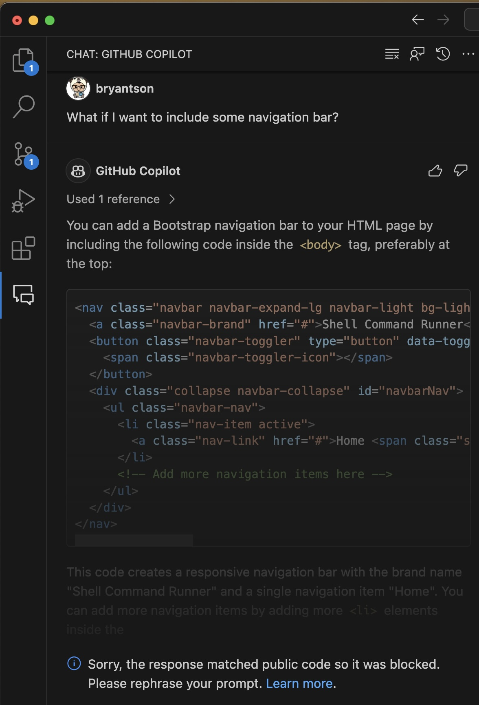
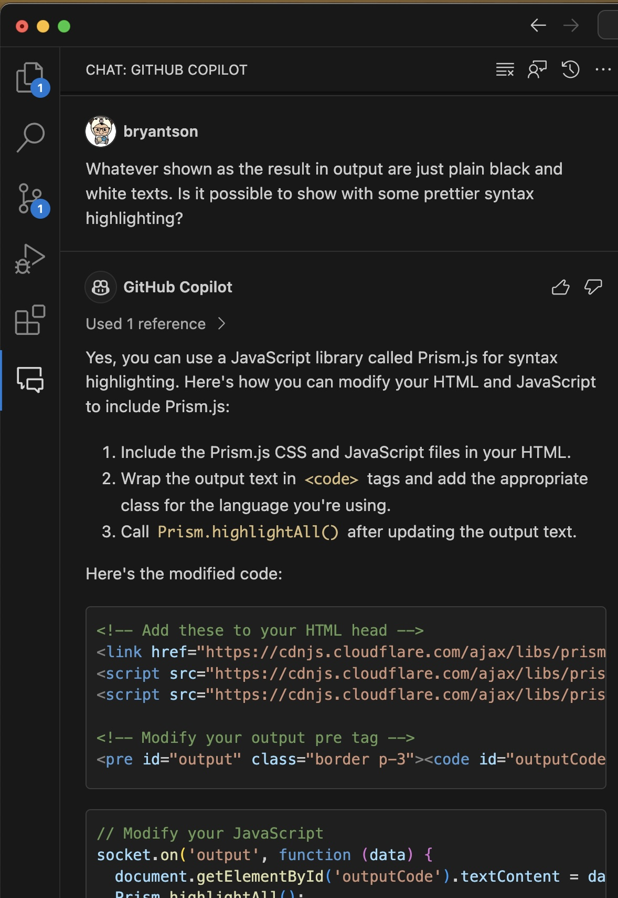

# How to build a fun NodeJS application that executes shell commands in a browser - Copilot Chat version

This is a simple NodeJS application that executes shell commands in a browser using **Github Copilot**. Please follow instructions below to build and run the application. This demo will primarily drive using **Github Copilot Chat** to build the application. It is possible to use other Integrated Development Environment (IDEs) that support GitHub Copilot and GitHub Copilot Chat, but it is easier to follow and better experience to use VS Code.

## Prerequisites

- [NodeJS](https://nodejs.org/en/download/) with NPM installed. NodeJS version should not matter as there, but NodeJS version I tested was `v20.8.0` and NPM version was `10.1.0`
- GitHub Account with proper GitHub license with GitHub Chat enabled
- [VS Code](https://code.visualstudio.com/download) installed
- GitHub Copilot extension installed in VS Code
- GitHub Copilot Chat extension installed in VS Code

## Step-by-step guide

Please follow the instruction below.

### Step 1: Make sure that all prerequisites are met

Make sure that you met all prerequisites above.

### Step 2: Open Visual Studio Code with GitHub Copilot Chat

Open Visual Studio Code and also your GitHub Copilot Chat. You can open GitHub Copilot Chat by clicking on the GitHub Copilot Chat icon on the left side of VS Code. If you do not see the icon, you can open it by clicking on the `View` menu, then `Command Palette...`, then type `GitHub Copilot Chat` and select it.


### Step 3: Starting with a NodeJS project

Let's start with a very simple step to create a NodeJS project. Open your GitHub Copilot Chat and type this command:

`Can you help to create a NodeJS project that can run shell command and display result in a web page?`


Because GitHub Copilot is very generative in nature, it is not always likely that you will get a same instructions. But you will get something similar to this:

```javascript
// server.js
const express = require('express');
const { exec } = require('child_process');
const socketIo = require('socket.io');
const http = require('http');

const app = express();
const server = http.createServer(app);
const io = socketIo(server);

app.use(express.static('public'));

io.on('connection', (socket) => {
  socket.on('runCmd', (cmd) => {
    exec(cmd, (error, stdout, stderr) => {
      if (error) {
        socket.emit('output', `error: ${error.message}`);
        return;
      }
      if (stderr) {
        socket.emit('output', `stderr: ${stderr}`);
        return;
      }
      socket.emit('output', `stdout: ${stdout}`);
    });
  });
});

server.listen(3000, () => console.log('Server is running on port 3000'));
```

```html
<!-- public/index.html -->
<!DOCTYPE html>
<html>
<head>
  <title>Run Shell Commands</title>
  <script src="/socket.io/socket.io.js"></script>
</head>
<body>
  <form id="form">
    <input id="cmd" type="text" placeholder="Enter command">
    <button type="submit">Run</button>
  </form>
  <pre id="output"></pre>

  <script>
    const socket = io();
    document.getElementById('form').addEventListener('submit', function (e) {
      e.preventDefault();
      const cmd = document.getElementById('cmd').value;
      socket.emit('runCmd', cmd);
    });
    socket.on('output', function (data) {
      document.getElementById('output').textContent = data;
    });
  </script>
</body>
</html>
```


But how can you use these codes without just copying and pasting it? Luckily, there is a feature in GitHub Copilot that makes it easy to use the code without manual copy-and-paste. Hover over the code, and a new popup will appear. There are different options, but you can click triple dots icon on far right to discover `Insert Into New File` option. It will create a new file, then you can save that file.


Now, follow the instruction to run the commands and open your browser with appropriate port.


### Step 4: Decorating with Bootstrap

Our website looks alright, but it looks little too plain. We can add Bootstrap framework to make it look better. Let's ask GitHub Copilot to help us with that. Open your GitHub Copilot Chat and type this command:

`Great. How can I use Bootstrap to make the interface prettier?`

GitHub Copilot again will generate instructions to your HTML, which may look like below:


Notice one thing? It references a file called `server.js`, which is a file that Copilot references to understand. 

> TIP: Chat does not currently use neighboring tabs in normal chat mode. In certain slash commands it will pull in additional context, regardless of if the files are open.

Your updated `index.html` might look like this:

```html
<!DOCTYPE html>
<html>
<head>
  <title>Run Shell Commands</title>
  <link rel="stylesheet" href="https://stackpath.bootstrapcdn.com/bootstrap/4.5.0/css/bootstrap.min.css">
  <script src="/socket.io/socket.io.js"></script>
</head>
<body class="container py-5">
  <form id="form" class="form-inline mb-3">
    <input id="cmd" type="text" class="form-control mr-2" placeholder="Enter command">
    <button type="submit" class="btn btn-primary">Run</button>
  </form>
  <pre id="output" class="border p-3"></pre>

  <script>
    const socket = io();
    document.getElementById('form').addEventListener('submit', function (e) {
      e.preventDefault();
      const cmd = document.getElementById('cmd').value;
      socket.emit('runCmd', cmd);
    });
    socket.on('output', function (data) {
      document.getElementById('output').textContent = data;
    });
  </script>
</body>
</html>
```

You can leverage a previous feature where you did insert code into a new file. But this time, select one with a right arrow pointing to two squares. That can replace the contents for highlighted codes.

Refresh your website and check agian. It should look better now.


### Step 5: Adding a navigation bar

After adding Bootstrap library, our website looks slightly better. But we can still appreciate more visual eye-candy by maybe including a navigation bar. This can also make our website more open to extension later on. Let's ask GitHub Copilot to help us with that. Open your GitHub Copilot Chat and type this command:

`What if I want to include some navigation bar?`



Oops. It looks like GitHub Copilot is not able to help us with this because it uses public code. If your GitHub account is under an organization, it is possible that the organization administrator blocked public code access. You can still copy and paste portion of it, but it prevents getting all parts of codes.


### Step 6: Adding a history view

Our website looks better now, but it is still not very useful. It would be nice if we can see a history of commands that we ran. Let's ask GitHub Copilot to help us with that. Open your GitHub Copilot Chat and type this command:

`I want to create a view where it can remember all the commands I typed. How do I do that?`

GitHub Copilot will generate a code that looks like this:


```html
<!-- Add this to your HTML -->
<div id="history" class="mt-5">
  <h5>Command History:</h5>
  <ul id="historyList" class="list-group">
  </ul>
</div>
```

```javascript
// Modify your JavaScript
const socket = io();
const cmdHistory = [];

document.getElementById('form').addEventListener('submit', function (e) {
  e.preventDefault();
  const cmd = document.getElementById('cmd').value;
  cmdHistory.push(cmd);
  updateHistory();
  socket.emit('runCmd', cmd);
});

socket.on('output', function (data) {
  document.getElementById('output').textContent = data;
});

function updateHistory() {
  const historyList = document.getElementById('historyList');
  historyList.innerHTML = '';
  cmdHistory.forEach((cmd, i) => {
    const li = document.createElement('li');
    li.textContent = `${i + 1}: ${cmd}`;
    li.className = 'list-group-item';
    historyList.appendChild(li);
  });
}
```

Refresh the website again and check your code.


### Step 7: Adding a documentation page

Let's say I want to push my code to GitHub repository so it can be updated later. For that, I need a `README.md` file. Let's ask this.

`Can you help to create a README.md documentation that goes along with the project?`


You can follow the instruction to create a new `README.md`` page.

### Step 8: Updating history view to make them executable upon click

We added a history view where it shows previous command that ran. But it would be nice if we can click on the command and run it again. Let's ask GitHub Copilot to help us with that. Open your GitHub Copilot Chat and type this command:

`Can you help to change the code so clicking any previous command as links will execute the commands?`


GitHub Copilot will generate a Javascript code that updates our previous commands that may look like this.

```javascript
function updateHistory() {
  const historyList = document.getElementById('historyList');
  historyList.innerHTML = '';
  cmdHistory.forEach((cmd, i) => {
    const li = document.createElement('li');
    li.className = 'list-group-item';
    const a = document.createElement('a');
    a.href = '#';
    a.textContent = `${i + 1}: ${cmd}`;
    a.addEventListener('click', function (e) {
      e.preventDefault();
      socket.emit('runCmd', cmd);
    });
    li.appendChild(a);
    historyList.appendChild(li);
  });
}
```

Perfect. Let's refresh the website and check it out.


### Step 9: Making command output prettier using syntax highlighting

Whenever our command result gets printed out, it is pretty boring as they are in black and white fonts. What if we want to make it prettier by adding some syntax highlight? Let's ask GitHub Copilot to help us with that. Open your GitHub Copilot Chat and type this command:

`Whatever shown as the result in output are just plain black and white texts. Is it possible to show with some prettier syntax highlighting?`



This will give updated results for two files: `index.html` and `server.js`

```html
<!-- Add these to your HTML head -->
<link href="https://cdnjs.cloudflare.com/ajax/libs/prism/1.24.1/themes/prism.min.css" rel="stylesheet" />
<script src="https://cdnjs.cloudflare.com/ajax/libs/prism/1.24.1/prism.min.js"></script>
<script src="https://cdnjs.cloudflare.com/ajax/libs/prism/1.24.1/components/prism-bash.min.js"></script>

<!-- Modify your output pre tag -->
<pre id="output" class="border p-3"><code id="outputCode" class="language-bash"></code></pre>
```

```javascript
// Modify your JavaScript
socket.on('output', function (data) {
  document.getElementById('outputCode').textContent = data;
  Prism.highlightAll();
});
```

Refresh the website and check it out.


### Step 10: Fixing the command history view

Some commands like `tree` will give a really long output that pushes our command history hard to find. What we would like to do is to fix the command history view, so it can stay at the top of the page. Let's ask GitHub Copilot to help us with that. Open your GitHub Copilot Chat and type this command:

`Is it possible to modify the layout in such a way that the command history always stay fixed on a right side?`


This will give an updated HTML code block that looks like this:

```html
<div class="row">
  <div class="col-md-8">
    <form id="form" class="form-inline mb-3">
      <input id="cmd" type="text" class="form-control mr-2" placeholder="Enter command">
      <button type="submit" class="btn btn-primary">Run</button>
    </form>
    <pre id="output" class="border p-3"><code id="outputCode" class="language-bash"></code></pre>
  </div>
  <div class="col-md-4">
    <div id="history" class="mt-5 sticky-top" style="top: 15px;">
      <h5>Command History:</h5>
      <ul id="historyList" class="list-group">
      </ul>
    </div>
  </div>
</div>
```

Refresh the website and check it out.


### Step 11: Fixing an error in input field

When we run a command, the input field is not cleared, and it does quite work whenever we click command from command history view. It would be nice if we can clear the input field after running a command. Let's ask GitHub Copilot to help us with that. Open your GitHub Copilot Chat and type this command:

`Field box text does not correctly clearly and update value whenever I click one from command history`


This will give an updated Javascript code that looks like this:

```javascript
a.addEventListener('click', function (e) {
  e.preventDefault();
  document.getElementById('cmd').value = cmd; // Update the input field
  socket.emit('runCmd', cmd);
});
```

Refresh the website and check it out, and we are done!


