# How to build a fun NodeJS application that executes shell commands in a browser - No Copilot Chat version

This is a simple NodeJS application that executes shell commands in a browser using **Github Copilot**. Please follow instructions below to build and run the application. This demo will not use **Github Copilot Chat**. 

> This demo is specifically made for customers who did not turn on Copilot Chat. Please [use other demo](../Command-Execution-WebApp-NodeJS-CopilotChat) as if customers can use Copilot Chat.

It is possible to use other Interative Development Editor (IDEs) that support GitHub Copilot and GitHub Copilot Chat, but it is easier to follow and better experience to use VS Code.

## Prerequisites

- [NodeJS](https://nodejs.org/en/download/) with NPM installed. NodeJS version should not matter as there, but NodeJS version I tested was `v20.8.0` and NPM version was `10.1.0`
- GitHub Account with proper GitHub license with GitHub Chat enabled
- [VS Code](https://code.visualstudio.com/download) installed
- GitHub Copilot extension installed in VS Code

In addition, this demo, compared other one using GitHub Copilot Chat, requires quite a knowledge of NodeJS, HTML, and Javascript as it requires to know what is right or wrong. Also, note that refactoring capability is limited as only way to improve the code is by rewriting comment or provide morea accurate context.

## Step-by-step guides

Please follow the instruction below.

### Step 1: Make sure that all prerequisites are met

Make sure that you met all prerequisites are met :) 

### Step 2: Starting with a NodeJS project

Let's start with a very simple step to create a NodeJS project. Open your Visual Studio and create a new folder if you have not. Create a file called `index.js`, and type in the following command as a Javascript comment.

`// NodeJS project that can run shell command and display result in a web page`

Hit **Tab** button to accept the suggestion. You can also toggle through suggestions.

If you keep typing, you will see GitHub Copilot makes suggestions line by line as shown below. It can sometimes make a block suggestion.

> Note that GitHub Copilot is highly generative in nature. Thus, note that the result what you get will not be same as mine.

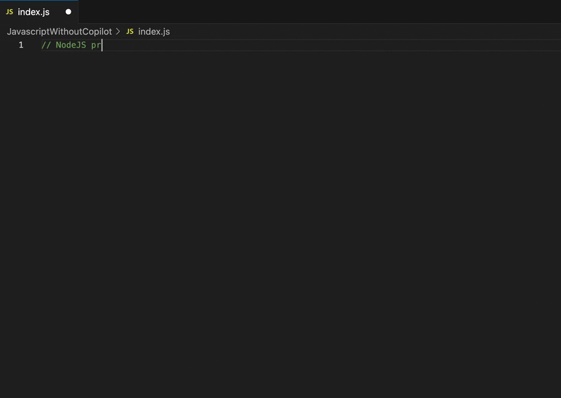

This, as you can see, is one way to get suggestions from GitHub Copilot. Copilot can get the suggestion through whatever the context you are providing. More detailed and accurate your context is, GitHub Copilot can generate better result.

Now, what if you want to see more recommendations? What about block? Because you decided not to turn off GitHub Copilot Chat, suggestions are bit limited, but we can still work with what we have.

Delete the Copilot's suggestion, and let's go back to the end of your comment. Another cool feature of Copilot is the ability to see 10 full-page suggestions, instead of a single one-liner suggestion, and choosing which suits the code best.

To do that, press `^ + Return`` on a Mac keyboard or `Ctrl + Enter`` on Windows to open a list of suggestions, as shown below.


Sometimes, you will get all 10 suggestions. Othertime, you will get less than that. Scroll to see what codes look right to you. And even these suggestions are not same all the time because Copilot is generative in nature. For me, I want a NodeJS logic that can run shell commands and display result in a web page. So, I will find one that opens port and listens to it, then display webpage in public as static file.

Click **Accept Solution** link to the suggestion block that you wants to apply.

### Step 3: Understand the generated code and refactor

Now, your suggestion might come with `index.html` if you are lucky. Mine did not. But I still want to see through the code to see if it does what it wants to be, understand what dependencies are needed, and refactor the code to make it more readable.

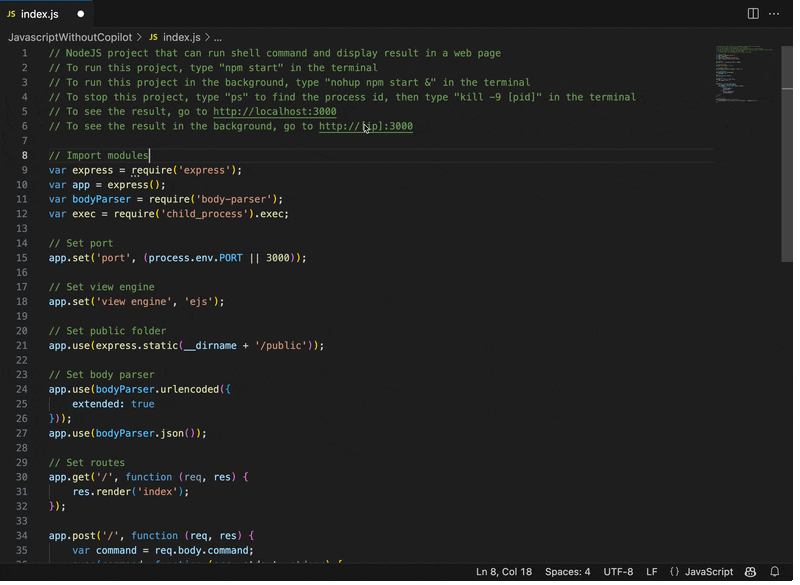

I decided to take out a huge block of comments and understood some dependencies here and there. For example. this one uses expressJS, so I definitely need that later.

But yours might look completely different from mine. Again, if we were to use Copilot Chat, we could get better suggestion, so using with GitHub Copilot Chat requires more knowledge from developer.

Make sure that your codes have some logic to use **express** library to read from **public** folder and display HTML page.

Save the file.

### Step 4: Creating index.html as static content

Next, we need to create `public` folder, where we will store `index.html` file. Create a folder called `public` and create a file called `index.html` inside the folder.

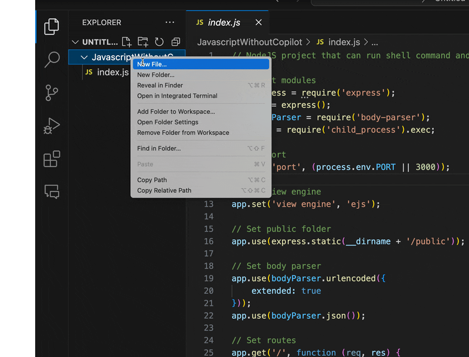

Once you created it, type some html codes like `<html></html>`. You will see GitHub Copilot will make suggestions as you type.

Type more contents such as setting title and adding a button where we can execute shell commands. Notice how GitHub Copilot makes suggestion as type.

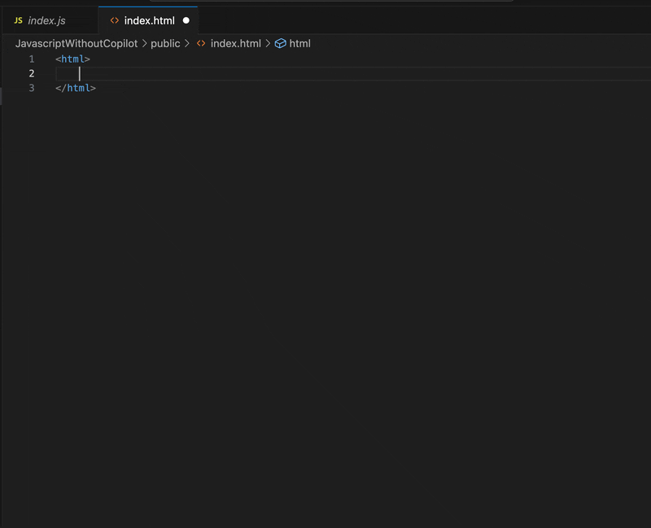

### Step 5: Make a test run and see it fails then fix by adding dependency

Let's try to test our website! You can open a separate Terminal window to run it, but I will try to use built-in Terminal inside Visual Studio Code. 

- For Visual Studio Code, you can go to **Terminal** menu and select **New Terminal**. That should open a Terminal in the current directory.
- Or, if you are using other Terminal, you can navigate to the directory where you have `index.js` file and `public` folder.

From there, type the following command to run the application: `node index.js`. You should see the error complaining about missing depenedencies.

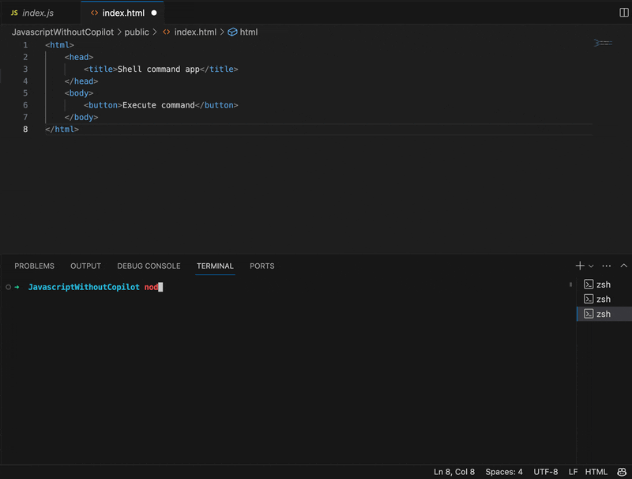

Uh oh! What happened? This is expected because ExpressJS is a dependency that does not come with NodeJs. We need to install it.

> If we did have GitHub Copilot Chat, we could ask to troubleshoot it. But unfortunately, we don't. So, we need to know how to troubleshoot by knowing what is needed.

For NodeJS, you can use a command like `npm install express` to install it. But we want to manage through `package.json`. 

Let's create a `package.json` file. Once you created the file, you can start typing to create a JSON object. You will see GitHub Copilot will make suggestions as you type.

Make sure to overwrite suggestions made for **name**, **version**, and **description** as Copilot's suggestions might not be too accurate. Most importantly, you need to add dependency. Type `dependencies` and hit **Tab** button to accept the suggestion. Most likely, you will see a suggestion like this.

```json
"dependencies": {
    "express": "^4.17.1"
}
```

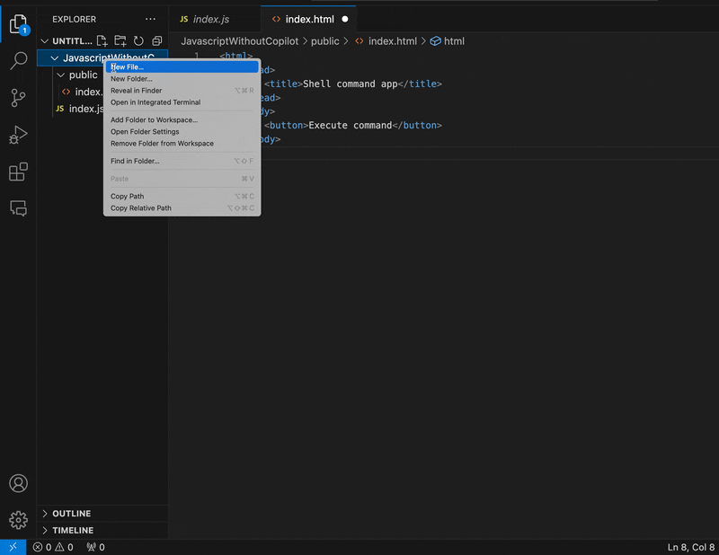

That version you see there might be the latest or one that you want. This is one of shortcomings of GitHub Copilot as enforcement of version is not there. But you can always change it later.

> Tip: Always discuss with your team members about what versions and dependencies you want to use. GitHub Copilot is not a replacement for that.

Once you are done, go back to your Terminal again. Then, type the following command to install dependencies: `npm install`. This will install all dependencies listed in `package.json` file.

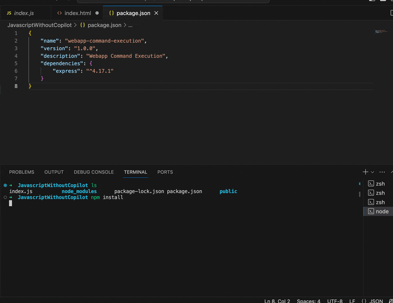

Once you are done installing, let's check what resources got created. You can see **node_modules** folders are there. If you expand that, you will see **express** folder. That means we have successfully installed dependencies. You will also see other folders and files that are created. These are created by **npm** command.

You will also notice `package-lock.json` file. This file is good to have because we can ensure that we can install the same version of dependencies later. This is a good practice to have.

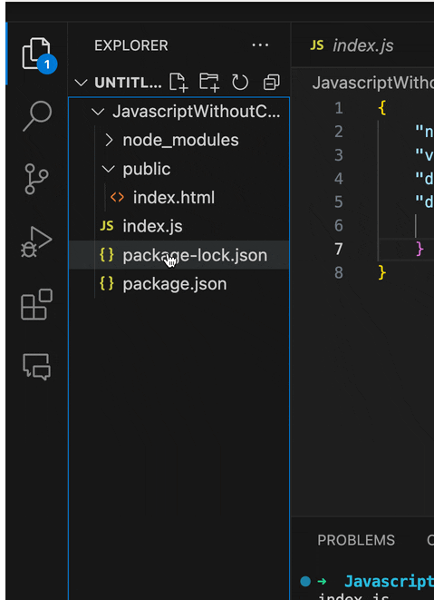

### Step 6: Starting server and checking our first success

Let's go back to our Terminal and type the command to start the server: `node index.js`. You should see the message saying that the server is running.

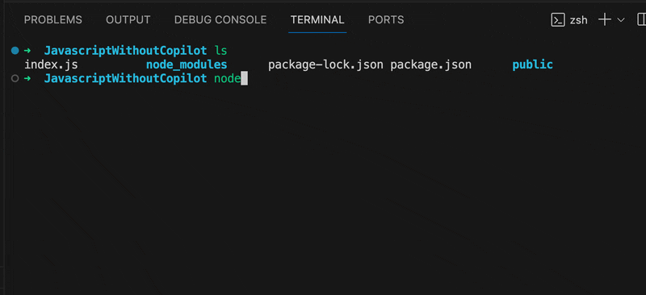

Now, you can open a browser window and visit `http://localhost:3000`. You should see the page with a button. If you click the button, you will see nothing happens. I will open a Chrome DevTool to troubleshoot if it is really indeed the case. If you are using other browser, don't worry. You can still follow along.

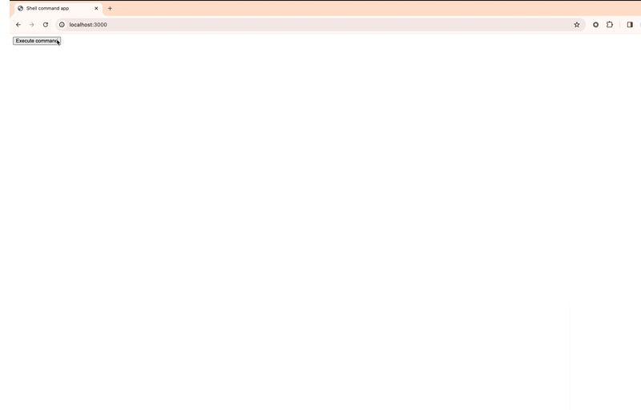

Alright. So, it looks as we need to add some logic to execute shell commands. Let's go back to our files and add some logic and design.

### Step 7: Adding design and logic for executing shell commands

First, we want to modify our HTML file to include the following things:
- Make sure button can execute command when I click button
- Text field to enter shell command

We also need to add result page, but we will do that later.

I will use a comment this time to ask GitHub Copilot to help me with this. I will type the following comment:

`<!-- Execute shell command when click button -->`

Again, Copilot is very generative in nature. Based on what you have, it may give what you exactly want or something completely different. Make your best judgement to accept the suggestion.

As you can see, I tried to modify comment multiple time to get what I want. Keypoint, though, is to know what you want to do. If you don't know what you want to do, you will get a lot of suggestions that you don't want.

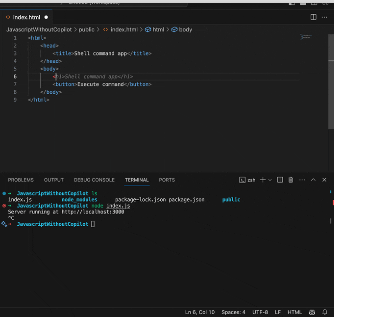

Once you are done with `index.html`'s code, we need to add Javascript logic to make sure it can execute. You can type comment like the following:

`<!-- Javascript function to execute shell command by sending to function in index.js and return value -->`

Even with detailed description, your result might be hit or miss. You can use **Synthesizing solution** suggestion to browse through possible options. I found the one I want, but I still have to modify to get to a result that I want. Again, make your best judgement.


Now, let's switch to `index.js` where it can handle the request. You need to switch back and forth between `index.html` and `index.js` to make sure you can get the right code. This is one of the shortcomings of GitHub Copilot as it does not have a way to keep track of what you are doing. So, you need to keep track of what you are doing.

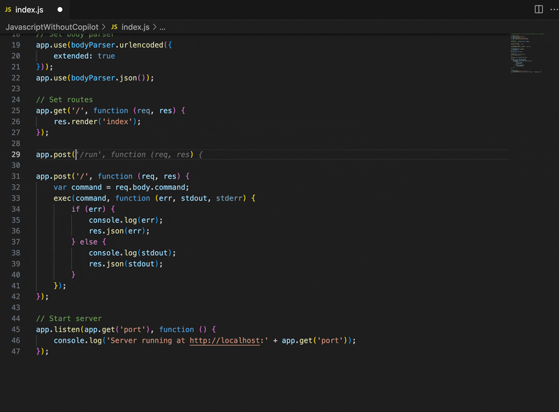

Now, to troubleshoot, it is helpful to add a log so we can know if something fails, we know where it fails.

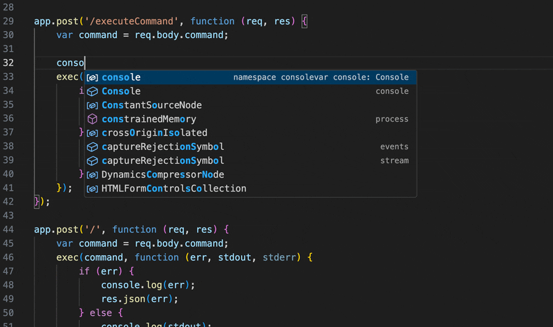

Make sure that you stop your NPM server and starts again. This is necessary because we modified `index.js`. Then, start server again with `node index.js`. Now, you can go back to your browser and test it out. You should see the result like this:

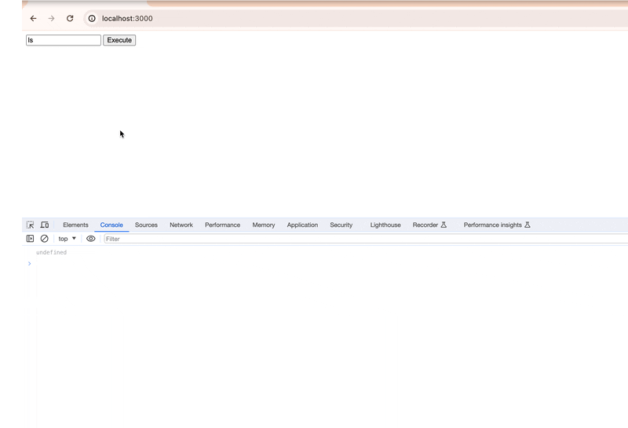

If you look through Chrome DevTool, you may see undefined or nothing is happening. Again, the result can look different if you used different snippets than I am. But if you do see undefined, it means that we need to fix our code.

Because we added a log through `console.log`, we can check that to see what's shown there. As you can see, command does go to function in `index.js`, but it show seems to fail while it ends up returning to `index.html`. 

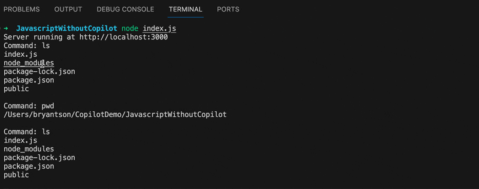

This is because we are not returning the correct result. Let's fix that.

### Step 8: Add the logic to show the result

If we go back to `index.html`, we need to make sure that the data returned from the function in `index.js` to pass correctly. At the same time, we want to make sure that the result can be displayed in the webpage, not just in the console.

This is really where your understanding of Javascript and HTML helps. I will follow these two steps:

1. Introduce **Result** section in `index.html` to display the result. In this way, Copilot can understand that we want to display the result in that specific field.
2. Modify the Javascript function in `index.js` to return the result. Because we provided HTML tag through first step, it should know where to display it.

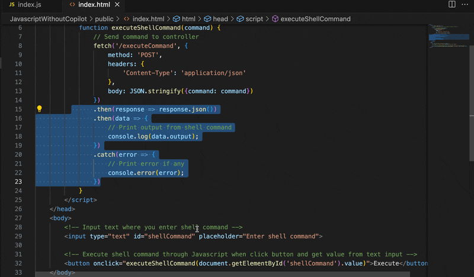

As you can see, I created a comment with the following description:

`<!-- Display result with highlighted code -->`

This ends up creating a `<pre>` tags block, though yours might look little different.

Then, I go back to Javascript code and make sure that response gets returned and change the code to display the result in the HTML page.

Your result should look like this.

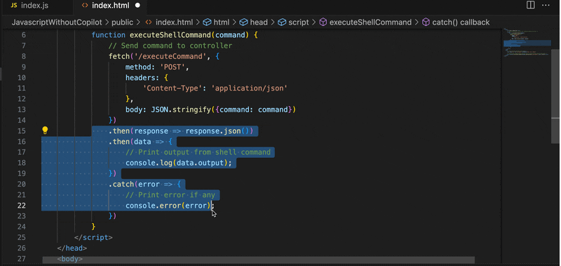

Now, if we go back and test our webpage again, you should see the result like this:

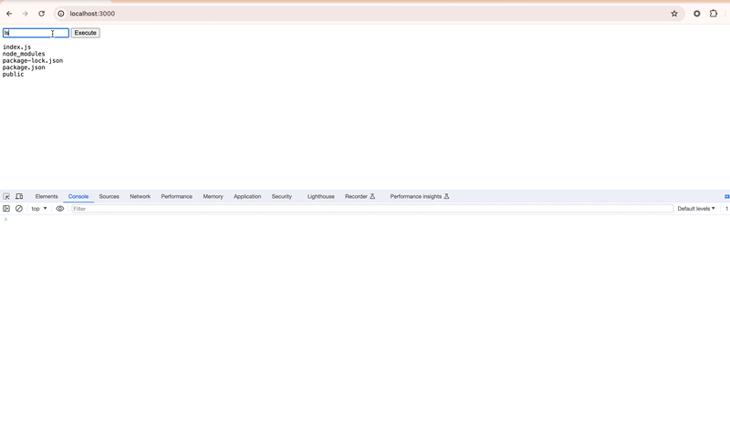

### Step 9: Make website prettier with Twitter Bootstrap

Our result looks good, but it looks too plain. To make the website prettier, we will use Twitter Bootstrap. I will use the following comment to ask Copilot to help me with this.

`<!-- Import Bootstrap library -->`

This should import Bootstrap from CDN. This version might not be the latest or one that you want to use. So, you have to make sure that you are using the right version.

From there, you can change buttons and text field to make sure they get applied with Bootstrap.

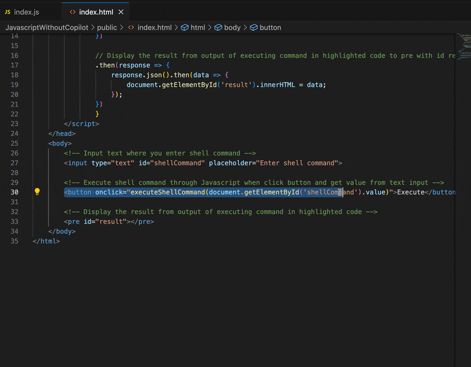

Let's go back to your web browser and test it. You can see that it looks much better now, but it probably can need some more improvement.

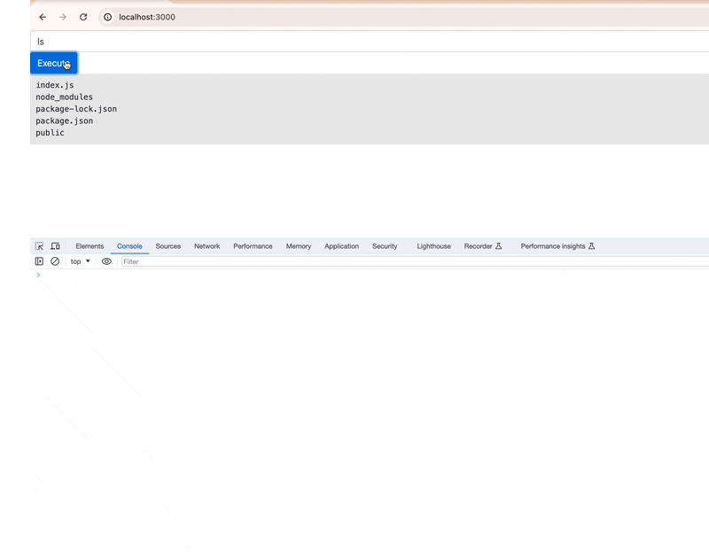

Bootstrap has a concept called **Container** and **Columns**. We may want to create two columns where the larger column can display the result while the smaller column can be the place where you can enter the command.

Go back to your `index.html` and enter the following comment.

`<!-- Bootstrap container with two columsn: left column 60% and right column 40%`

Copilot should create a container with two columns. You can then modify the code to make sure that the result is displayed in the left column while the text field and button are displayed in the right column. You have to do some copy-and-paste as shown here.

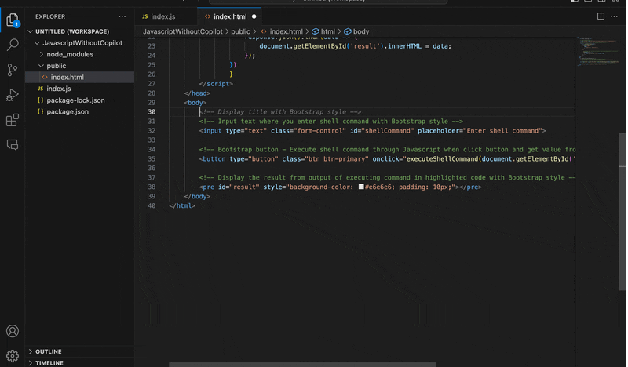

Now, if you go back to your browser and test it, you should see the result like this:

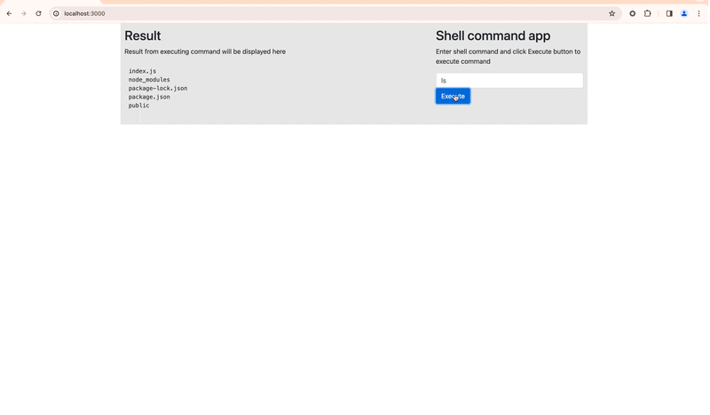

Hooray! Using GitHub Copilot, we are done with creating a simple website that can execute shell command. You can use this as a starting point to create your own website.
